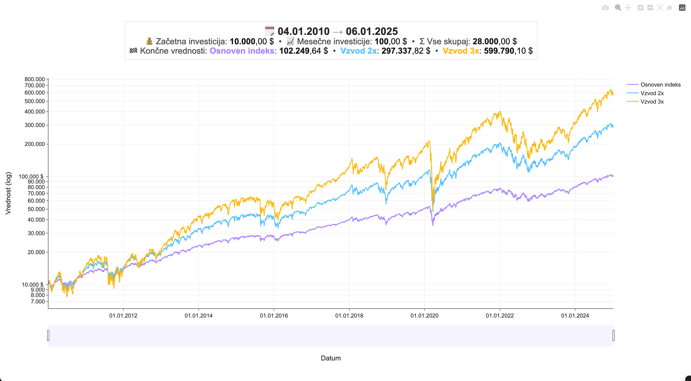

# ETF-ji z vzvodom - Primerjalnik donosov

## Aplikacija kaj dela - 1. Funkcionalnost (file: main.py) - CLI verzija

Na podlagi: 
- začetne investicije,
- mesečnih vplačil,
- dolžina let (intervalov)

Primerja donosov osnovnega indeksa, 2x vzvoda in 3x vzvoda na vseh intervalih za izbrano število let (podprti indeksi: S&P 500, Nasdaq 100 in Nasdaq Composite)

Program nam nato izpiše tudi statistiko, katera različica je bila najboljša in v koliko primerih. 

Pravtako izpiše statistiko, za vse skupaj in naredi izračun kolikorat je bil kater najboljši v procentih!


## Prikaz rezultatov danih za 1. Funkcionalnost:
Na podlagi vhodnih podatkov:
- Indeks: S&P 500
- Začetna investicija: 1000
- Mesecna investicija: 100
- Dolžina intervalov: 15

Rezultati:
```
Datum | NAJBOLJSI (narejen plus/minus, vse skupaj) >> +% >> DRUGI (narejen plus/minus, vse skupaj) >> +% >> TRETJI (narejen plus/minus, vse skupaj)

1927-12-30-1942-12-30 | -7,206.13, 20,793.87 >> +101.04% >> -17,657.02, 10,342.98 >> +76.72% >> -22,147.38, 5,852.62  
1928-01-03-1943-01-04 | -6,819.44, 21,180.56 >> +96.52% >> -17,222.36, 10,777.64 >> +72.56% >> -21,754.20, 6,245.80  
                                                    .
                                                    .
                                                    . 
2009-01-02-2024-01-02 | 431,121.24, 459,121.24 >> +77.99% >> 229,943.81, 257,943.81 >> +168.07% >> 68,221.12, 96,221.12  
2010-01-04-2025-01-06 | 571,790.10, 599,790.10 >> +101.72% >> 269,337.82, 297,337.82 >> +190.8% >> 74,249.64, 102,249.64  

Direktna primerjava med testing/osnoven.csv, testing/vzvod-2x.csv in testing/vzvod-3x.csv  

💰 Začetna investicija: 10000  
📈 Vse mesečne investicije: 18000  
💵 Vse skupaj investirano: 28000  

Procenti so izračunani na podlagi 'koliko imamo vse skupaj'  

'Najboljši' je tisti z največjo vrednostjo v stolpcu 'koliko imamo vse skupaj' 

✔ testing/osnoven.csv je bil najboljši v 14 primerih (16.67%)  
✔ testing/vzvod-2x.csv je bil najboljši v 12 primerih (14.29%)  
✔ testing/vzvod-3x.csv je bil najboljši v 58 primerih (69.05%)  

 
```
Pomembna opomba 1: vzet je osnoven (S&P indeks Nasdaq-100, Nasdaq Composite), in vzvod je narejen na podlagi ročnega vsakodnevnega balansiranja. 

Pomembna opomba 2: vzeti so osnovni indeksi, torej tukaj ni upoštevanih dividend, ki so nekje 1,2% za S&P 500.

Čisto vse je težko upoštevati, ampak neglede na to, so izračuni precej natančnen pokazatelj realnosti. (čeprav v bodoče morda naredim posodobitev in upoštevam tudi to)

V mislih sem imel; 
- na eni strani ne upoštevanja dividend pri S&P 500, ki so cca 1,2% in
- na drugi strani stroški pri posredniku in izdajatelju etfjev (navaden; cca 0,07% na leto, vzvod; 0,7% na leto)
Torej da stroške pri posredniku in izdajalcu na drugi strani izenačijo dividende na drugi strani.

## Aplikacija kaj dela - funkcionalnost 2 (file: main-2.py) - CLI verzija + html 

Moramo dati iste vhodne podatke, kot pri 1. Funkcionalnosti!

Funkcionalnost 2 naredi zelo podobno kot 1. Funkcionalnost, le da za vsako obdobje nariše graf, ki prikazuje kako se je gibala donosnost vseh treh različic (navaden, 2x, 3x) skozi čas. Tukaj ni toliko v ospredju statistika, kot to, da je grafično prikazano kako se je vrednost vsake različice gibala v vsakem obdobju.
Ena vrstica v main.py je en graf!

Recimo vrstica iz 1. Funkcionalnosti:
```
2010-01-04-2025-01-06 | 571,790.10, 599,790.10 >> +101.72% >> 269,337.82, 297,337.82 >> +190.8% >> 74,249.64, 102,249.64 
```
je tukaj prikazana v obliki grafa, kjer se nazorno vidi potek vseh treh krivulj (različic - osnoven, 2x, 3x):



## Namestitev programa
1. Kloniraj repozitorij:
   - ` git clone https://github.com/Zankooo/Leverage-Etfs.git `
2. Namesti potrebne knjižnice:
   - ` python3 -m pip install -r requirements.txt ` (za MacOs)
   - ` python3 -m pip install -r requirements.txt ` (Windows)
3. Ustvari in aktiviraj virtualno okolje:
   - `python -m venv .venv`
   - `.venv\Scripts\activate` (Windows)
   - `source .venv/bin/activate` (macOS/Linux)

## Zagon programa
Zagon 1. Funkcionalnosti:
- `python3 main.py` (macOS/Linux)
- `python main.py` (Windows)

Zagon 2. Funkcionalnosti:
- `python3 main-2.py` (macOS/Linux)
- `python main-2.py` (Windows)

<hr>

## Teorija za laike
### Prvo; kaj je ETF?
- To je sklad, ki se tako kot recimo delnica podjetja Apple, trguje na borzi 
- Glavna razlika je, da če kupimo delnico Apple, smo lastniki samo podjetja Apple, v etf skladu so pa mnoge delnice... Sp500 je recimo skupek največjih ameriških podjetij, kjer so podjetja razvrščena po velikosti. Večje kot je podjetje večji procent tega podjetja je v indeksu (etfju). V Nasdaq 100 je sto največjih tehnoloških podjetij...
- Etf isto kupuješ/prodajaš 
- ETF-ji razpršijo tveganje: z eno naložbo kupiš košarico podjetij, ne staviš “all-in” na eno ime. Posamezna delnica lahko na dolgi rok zastane ali pade — tveganje koncentracije je veliko.Zmagovalci se menjajo: nekoč so bili top (Exxon, General Electric, Citigroup, Aig), danes pa (Nvidia, Microsoft, Apple, Google, Amazon, Meta).
- Za dolg rok ima etf boljse razmerje med donosnostjo izgubo in mirnim spanjem -> in vedno se je pobral in prišel spet na vrh! Če se je vedno do sedaj v 98 letni zgodovini sp500 pobral, se bo ob kakšnih padcih v bodoče tudi zagotovo pobral. 


### Kaj je pa ETF z vzvodom (leverage ETF)?
- vzvod si lahko predstavljamo, da je recimo nek etf krat 2 ali krat 3.
- torej sp500 z vzvodom dva, je sp500 2x, to pomeni da je dvakratnik sp500

### Problemi oz. fora vzvoda?
- zdej če to bere nek laik si misli; gremo na glavo. Če je lani sp500 zrastel za 10% je vzvod 2x zrastel za 20% in vzvod 3x 30%. 
- ampak ni tako. Vemo da je vse 'gor dol'. 
    - Primer 1: Imamo prvi dan 100eur investirano in osnoven sp500 zraste 1% -> imamo 101eur. Drugi dan pa pade 1% -> imamo 99,99eur. Torej imamo manj kot smo imeli. Gremo naprej. Tretji dan spet zraste za 1% -> imamo 100,9899eur. Četrti dan pade za 1% -> imamo 99,98eur. In tako naprej... 
    - Primer 2: Imamo prvi dan 100eur investirano in 2x vzvod sp500 zraste 2% -> imamo 102eur. Drugi dan pa pade 2% -> imamo 99,96eur. Torej imamo manj kot smo imeli. Gremo naprej. Tretji dan spet zraste za 2% -> imamo 101,9592eur. Četrti dan pade za 2% -> imamo 99,92eur. In tako naprej...
- vidimo problem ane? Več kot je nihanja gor dol, volatilnost, slabše je za vzvod. Ker se matematično zgublja donos. Zdej si pa predstavljajmo da imamo vzvod delnice Tesle, ki je znana da gre veliko gor dol. Osnovna 3% gor in 3% dol. Vzvod v tem primeru 6% in 6% dol. Koliko hitreje bi izgubljali!

### Ugotovitev
- torej za vzvod je najboljše, da čim manj niha gor dol. Potencialno če bi nekdo garantiral da bo podjetje vsak dan zraste le 0,01%, kupil bi čim večji vzvod tega podjetja in zmagal bi. 
- torej volatilnost uničuje donos. Zato ni fajn kupovat vzvoda individualnih delnic ker individualne delnice še toliko bolj nihajo in donos se drastično izgubi. 
- za vzvod je idealno da je čim manj gor dol in počasna a vztrajno rast. 

<hr>

## Linki za podatke - samo za potrebe razvijalca!
### Sp500 (ustvarjen leta 1927)
- https://www.kaggle.com/datasets/paveljurke/s-and-p-500-gspc-historical-data - do danes 

### Nasdaq composite (ustvarjen bil 1971)
- https://www.macrotrends.net/1320/nasdaq-historical-chart -> ampak je le chart
- https://fred.stlouisfed.org/series/NASDAQCOM  -> od leta 1971

### Nasdaq 100 (ustvarjen bil 1985)
- https://fred.stlouisfed.org/series/NASDAQ100 - od leta 1986, eno leto kasneje
