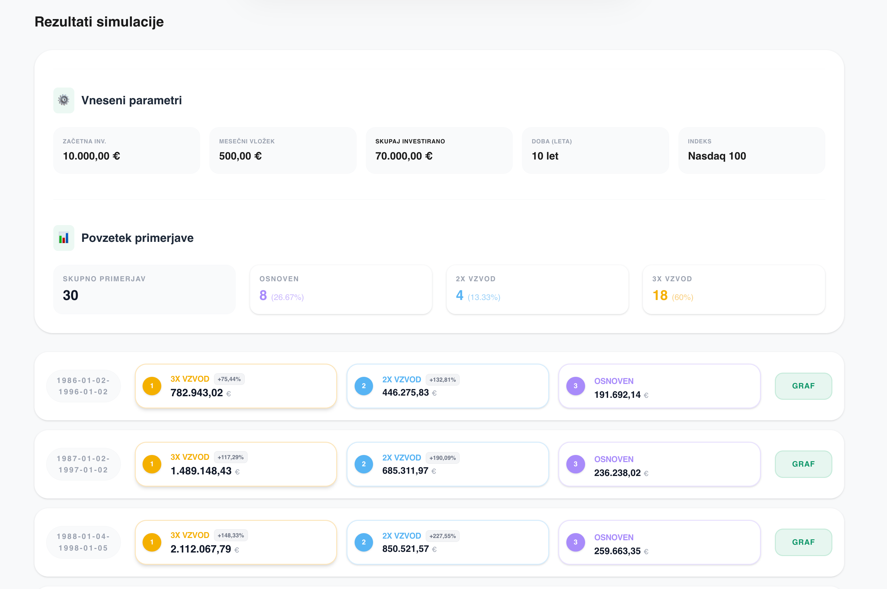

# O aplikaciji

Leverage ETFs je aplikacija za zgodovinsko analizo investicijskih strategij. Primerja osnovni indeks s simuliranima 2x in 3x vzvodnima različicama.

## Namen projekta
Projekt je namenjen raziskovanju vpliva vzvoda, volatilnosti in dolžine naložbenega obdobja. Ne uporablja se za napovedovanje prihodnosti in ne predstavlja investicijskega priporočila.

## Vhodni podatki

Uporabnik izbere:

- začetno investicijo;
- mesečni vložek;
- dolžino obdobja v letih;
- enega izmed podprtih indeksov.

Podprti indeksi so S&P 500, Nasdaq 100 in Nasdaq Composite.

## Kaj aplikacija izračuna

Za vse razpoložljive zgodovinske intervale izbrane dolžine aplikacija:

1. simulira začetni in redne mesečne vložke;
2. izračuna končno vrednost strategij 1x, 2x in 3x;
3. strategije razvrsti od najboljše do najslabše;
4. izračuna razliko med njimi;
5. prešteje, kolikokrat je bila posamezna strategija najboljša.

Rezultat je povzetek deležev zmag in seznam primerjav po obdobjih.

## Grafi

Za vsak zgodovinski interval backend ustvari podroben HTML-graf. Frontend ga prikaže v modalnem oknu, ne da bi uporabnik zapustil aplikacijo.

