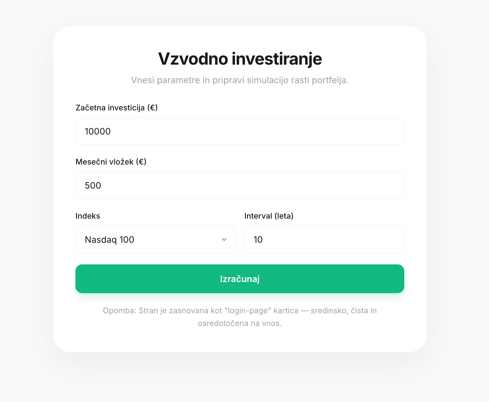
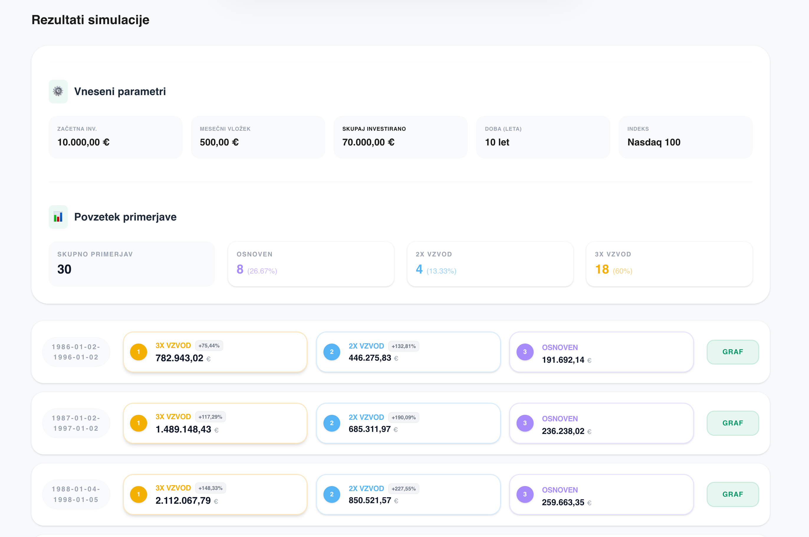
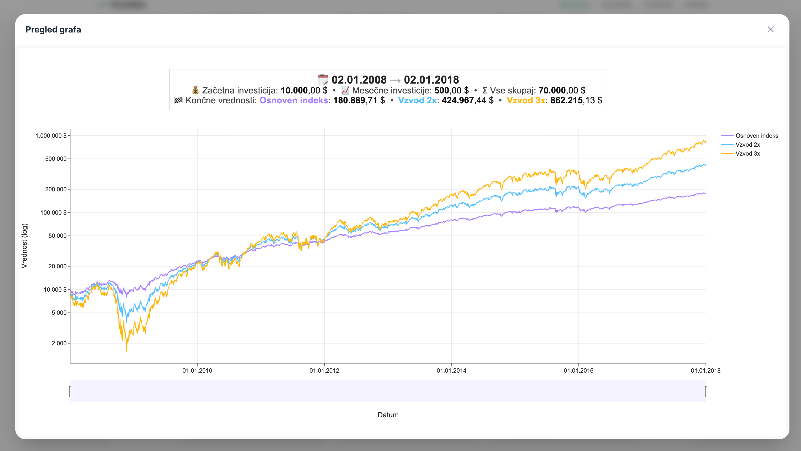

# Leverage ETFS - analiza zgodovinskih donosov

## Predstavitev aplikacije

**Leverage ETFs ti pomaga raziskati, kaj bi različne stopnje vzvoda pomenile za tvojo naložbo skozi čas.** Z lastnim začetnim vložkom in mesečnimi vplačili lahko primerjaš strategije 1x, 2x in 3x ter spremljaš njihov razvoj na zgodovinskih podatkih.

Aplikacija poveže končne rezultate z zgodbo za njimi: kdaj je vzvod prinesel prednost, kako globoki so bili vmesni padci in koliko je na izid vplivalo leto začetka investiranja. Pregledne primerjave in interaktivni grafi omogočajo, da razlike med strategijami raziščeš na konkretnih primerih.

## Kaj lahko raziščeš

- **Vpliv vzvoda:** kako so se rezultati 2x in 3x strategij razlikovali od strategije brez vzvoda.
- **Pomen časa:** kako so se rezultati razlikovali glede na dolžino investiranja in začetno leto.
- **Redno vlaganje:** kako se je naložba razvijala ob začetnem vložku in mesečnih vplačilih.
- **Pot do končnega rezultata:** kakšna rast, nihanja in padci so spremljali posamezno strategijo.

Za razlago osnovnih pojmov preberi [osnove ETF-jev in vzvoda](etf-basics.md).

## Nastavi svojo simulacijo

Za zagon aplikacije na svojem računalniku sledi [navodilom za namestitev in zagon](installation.md).

Izbereš enega izmed treh indeksov — **S&P 500, Nasdaq 100 ali Nasdaq Composite** — ter določiš:

- začetni vložek;
- mesečno vplačilo;
- dolžino investiranja v letih.

Za vse tri strategije se uporabijo enaki vložki in enako obdobje, kar omogoča neposredno primerjavo njihovih rezultatov za zgodovino.

## Primerjaj rezultate skozi zgodovino

Aplikacija izbrano dolžino investiranja preveri v več zgodovinskih obdobjih. Začetek premika po letih in vključi obdobja, za katera je na voljo dovolj podatkov. Tako lahko na primer primerjaš več desetletnih naložb z različnimi začetnimi leti.

Izvor podatkov za posamezne indekse je predstavljen na strani [Viri podatkov](data-sources.md).

Za vsako obdobje prikaže končne vrednosti strategij, njihovo razvrstitev in odstotne razlike med njimi. Skupni povzetek pokaže, kolikokrat je posamezna strategija dosegla najvišjo končno vrednost in kolikšen delež analiziranih obdobij to predstavlja.

## Oglej si razvoj naložbe

S klikom na **Graf** ob posameznem obdobju odpreš interaktivni prikaz gibanja vseh treh strategij za želeno obdobje. Primerjaš lahko njihovo rast, vmesne padce in okrevanja ter preveriš, kako so dosegle prikazano končno vrednost.

## Kaj je vključeno v model

Simulirane serije vključujejo reinvestiranje dividend, stroške financiranja vzvoda in upravljalske provizije. Donosi se sestavljajo dnevno, zato se v rezultatih odraža tudi vpliv nihajnosti oziroma volatility decay.

Projekt je namenjen raziskovanju zgodovinskih scenarijev. Rezultati predstavljajo simulacijo, ne dejanske zgodovine posameznega ETF-ja ali napovedi prihodnjih donosov. Način izračuna, uporabljene predpostavke in omejitve so opisani v [metodologiji](methodology.md).

## Tehnična dokumentacija

Za podrobnejši pregled delovanja aplikacije:

- [Arhitektura](architecture.md) — sestavni deli aplikacije in povezave med njimi.
- [Frontend](frontend.md) — uporabniški vmesnik, obrazec in prikaz rezultatov.
- [Backend](backend.md) — obdelava podatkov, izračuni in priprava grafov.
- [API](api.md) — komunikacija med uporabniškim vmesnikom in strežnikom.

Celoten pregled dokumentacije najdeš na [začetni strani](index.md).
