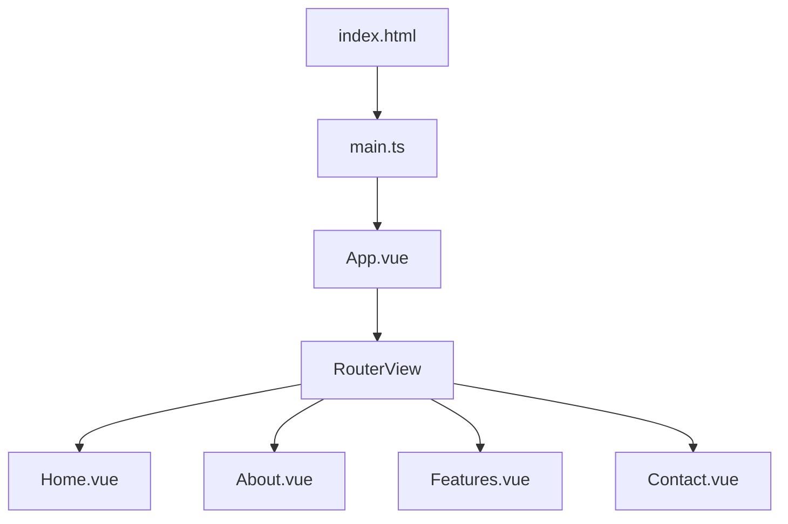

# Navodila za namestitev in delovanje
## MacOS in Windows
Instaliraj node_modules
```bash
npm install
```
Zaženi
```bash
npm run dev
```



```mermaid
flowchart TD
    A[index.html] --> B[main.ts]
    B --> C[App.vue]
    C --> D[RouterView]
    D --> E[Home.vue]
    D --> F[About.vue]
    D --> G[Features.vue]
    D --> H[Contact.vue]
```